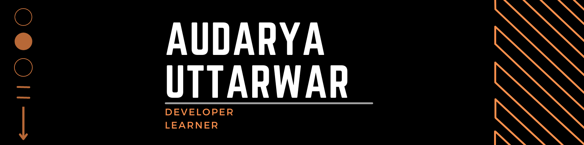

# Hi there, I'm Audarya 



<p align="center">
  
</p>

<p align="center">
  <a href="https://www.leetcode.com/audarya"></a>
  <a href="https://www.hackerrank.com/audiuttarwar2000"></a>
  <a href="https://www.linkedin.com/in/audarya-uttarwar"></a>
  <a href="mailto:audiuttarwar2000@gmail.com"></a>
  <a href="https://audarya.hashnode.dev/"></a>
</p>

## 👨‍💻 About Me

```go
package main

import "fmt"

type Developer struct {
    Name        string
    Role        string
    Languages   []string
    Technologies&DBs []string
    Focus       []string
    Hobbies     []string
}

func main() {
    me := Developer{
        Name:        "Audarya Uttarwar",
        Role:        "Software Engineer",
        Languages:   []string{"Go", "Node.js", "Python", "JavaScript", "C++"},
        Technologies&DBs: []string{"PostgreSQL", "MongoDB", "Redis", "MySQL", "AWS", "Express", "Django"},
        Focus:       []string{"Backend Systems", "Distributed Systems", "Data Structures & Algorithms"},
        Hobbies:     []string{"Sketching", "Music", "Learning Internals", "Long Drives 🏍️"},
    }
    
    fmt.Println("Always coding, always learning!")
}
```

## 🛠️ Tech Stack

<p align="center">
  <b>Languages</b><br>
  
  
  
  
  
</p>

<p align="center">
  <b>Backend & Frameworks</b><br>
  
  
  
  
</p>

<p align="center">
  <b>Databases & Tools</b><br>
  
  
  
  
  
  
  
  
  
</p>

<p align="center">
  <b>Frontend</b><br>
  
  
  
  
</p>

## 🔭 What I'm Currently Working On

- 💻 Enhancing my skills in **Golang**
- 🚀 Building low latency systems with **Golang** and **AWS**
- 📚 Learning distributed systems
- ✍️ Writing technical blogs on [Hashnode](https://audarya.hashnode.dev/)

## 📊 GitHub Stats

<p align="center">
  
</p>

<p align="center">
  
</p>

<p align="center">
  
</p>

## 📝 Resources

- 📄 [My Resume](https://drive.google.com/file/d/1A2CSX-_1ELXTGAfRN_fmwrIb4ztyO4IE/view?usp=sharing)

---

<p align="center">
  
</p>

<p align="center">
  <i>If you have any suggestions to this README, feel free to pull up a request. And if you liked it, go ahead and use it for yourself!</i>
</p>
